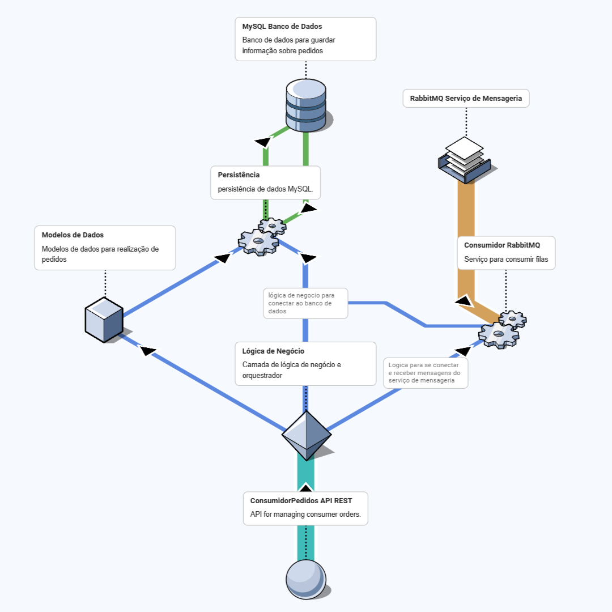

# ConsumidorPedidos

**ConsumidorPedidos** é uma aplicação .NET que processa pedidos, consumindo mensagens de uma fila RabbitMQ, armazenando os dados em um banco de dados MySQL e expondo uma API REST para consulta de informações sobre pedidos.

## Tecnologias Utilizadas

- **.NET 8**: Plataforma de desenvolvimento utilizada para criar a API e o microserviço.
- **MySQL**: Banco de dados relacional utilizado para armazenar os pedidos processados.
- **RabbitMQ**: Message broker utilizado para gerenciar a fila de pedidos.
- **Docker**: Ferramenta de containerização utilizada para orquestrar os serviços necessários (RabbitMQ, MySQL, API).

## Funcionalidades

- **Consumo de Pedidos**: O microserviço consome mensagens de uma fila RabbitMQ contendo informações de pedidos.
- **Armazenamento em Banco de Dados**: Os dados dos pedidos são armazenados em um banco de dados MySQL.
- **API REST**: A aplicação expõe uma API para consultar:
  - Valor total de um pedido
  - Quantidade de pedidos por cliente
  - Lista de pedidos realizados por cliente

## Arquitetura

A arquitetura da aplicação segue o padrão de microserviços e utiliza RabbitMQ para comunicação assíncrona entre os componentes. O diagrama a seguir ilustra a estrutura da aplicação:


- [Mais informações](./docs/arq/arq.md)

## Requisitos

- **.NET 8 SDK**: Para compilar, testar e rodar o projeto.
- **Docker**: Para rodar os containers de RabbitMQ, MySQL e a aplicação .NET.

## Como Executar

1. **Clone o Repositório**:
   ```bash
   git clone https://github.com/seu-usuario/ConsumidorPedidos.git
   cd ConsumidorPedidos
   ```

2. **Configuração do Ambiente**:
   - Certifique-se de ter o Docker instalado e funcionando.

3. **Subir os Serviços com Docker Compose**:
   - No diretório do projeto, execute o comando:
   ```bash
   docker-compose up -d
   ```

4. **Acessar a API**:
   - Após os serviços estarem em execução, a API REST estará disponível em `http://localhost:5005`.

## Portas dos Serviços

- **RabbitMQ**: 
  - Porta 5672 (AMQP)
  - Porta 15672 (Management UI)
- **MySQL**:
  - Porta 3307 (Conexão com o banco de dados)

## Testes

Para rodar os testes funcionais da aplicação:

```bash
dotnet test
```

