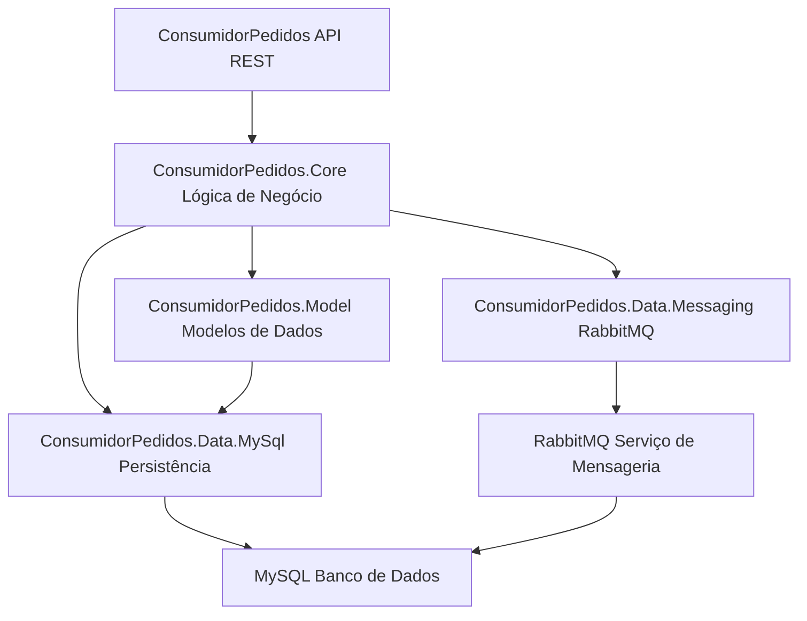

Para criar um diagrama de arquitetura para a aplicação `ConsumidorPedidos`, vamos desenhar a estrutura da aplicação dividida em camadas e interações com os componentes externos. Vou descrever como você pode criar o diagrama e quais elementos incluir:

### Diagrama de Arquitetura da Aplicação `ConsumidorPedidos`

#### 1. **Camadas da Aplicação**

- **ConsumidorPedidos** (API REST):
  - Recebe e processa requisições HTTP.
  - Interage com a camada `ConsumidorPedidos.Core` para a lógica de negócios.

- **ConsumidorPedidos.Core** (Lógica de Negócio):
  - Contém a lógica de negócios.
  - Usa interfaces para comunicação com `ConsumidorPedidos.Data.Messaging` e `ConsumidorPedidos.Data.MySql`.

- **ConsumidorPedidos.Data.Messaging** (Integração com RabbitMQ):
  - Responsável por enviar e receber mensagens para e do RabbitMQ.
  - Comunica-se com `ConsumidorPedidos.Core` para entregar as mensagens processadas.

- **ConsumidorPedidos.Data.MySql** (Persistência de Dados):
  - Implementa o acesso e a persistência de dados no MySQL.
  - Interage com `ConsumidorPedidos.Core` para operações de leitura e escrita no banco de dados.

- **ConsumidorPedidos.Model** (Modelos de Dados):
  - Define os modelos de dados usados por toda a aplicação.
  - Compartilhado entre `ConsumidorPedidos`, `ConsumidorPedidos.Core`, e `ConsumidorPedidos.Data.MySql`.

#### 2. **Componentes Externos**

- **RabbitMQ**:
  - Serviço de mensageria para comunicação assíncrona.
  - Recebe e envia mensagens para a camada `ConsumidorPedidos.Data.Messaging`.

- **MySQL**:
  - Banco de dados relacional para armazenar pedidos.
  - Interage com a camada `ConsumidorPedidos.Data.MySql` para operações de persistência.

#### 3. **Fluxo de Dados e Interações**

- **Fluxo de Dados:**
  - **ConsumidorPedidos** recebe uma requisição HTTP.
  - A API REST encaminha a requisição para `ConsumidorPedidos.Core` para processamento.
  - `ConsumidorPedidos.Core` pode interagir com `ConsumidorPedidos.Data.Messaging` para consumir mensagens ou com `ConsumidorPedidos.Data.MySql` para armazenar ou recuperar dados.
  - As mensagens são enviadas e recebidas pelo RabbitMQ.
  - Dados são persistidos ou recuperados do MySQL.

- **Comunicação Assíncrona:**
  - Mensagens são enviadas para o RabbitMQ pela camada `ConsumidorPedidos.Data.Messaging`.
  - `ConsumidorPedidos.Data.Messaging` consome mensagens de RabbitMQ e processa conforme necessário.
  
#### 4. **Diagrama**

Aqui está uma descrição de como o diagrama seria estruturado:

### Descrição do Diagrama:

- **ConsumidorPedidos (API REST)** é a camada principal que interage com **ConsumidorPedidos.Core (Lógica de Negócio)**.
- **ConsumidorPedidos.Core** se comunica com **ConsumidorPedidos.Data.Messaging (RabbitMQ)** para o envio e recebimento de mensagens e com **ConsumidorPedidos.Data.MySql (Persistência)** para operações de dados.
- **ConsumidorPedidos.Data.Messaging** e **ConsumidorPedidos.Data.MySql** interagem com os serviços externos **RabbitMQ** e **MySQL**, respectivamente.
- **ConsumidorPedidos.Model (Modelos de Dados)** é utilizado por todas as outras camadas para definição dos modelos de dados.

